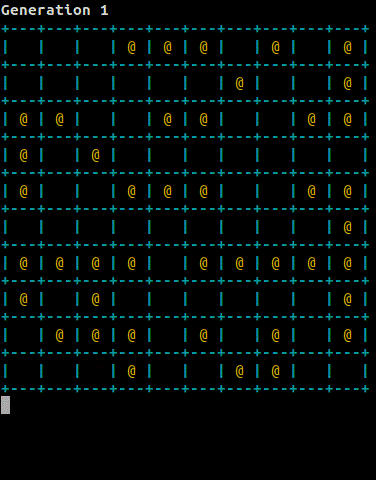

## Life Model
John H. Conway (Scientific American, October 1970, p. 120) invented a game
called _Life_ to model the process of birth, survival, and death.



| Rule          | Description   |
| ------------- | ------------- |
| **birth**     | an organism is born into an empty cell that has exactly three living `neighbor`s  |
| **survival**  | an organism with either two or three living `neighbor`s survives from one generation to the next  |
| **death**     | an organism with four or more `neighbor`s dies from overcrowding. an organism with fewer than two `neighbor`s dies from loneliness.  |


**neighbor** - any cell that touches a given cell C.


### Example: all N cells are neighbors of C.

```sh
+---+---+---+---+
|   | N | N | N |
+---+---+---+---+
|   | N | C | N |
+---+---+---+---+
|   | N | N | N |
+---+---+---+---+
|   |   |   |   |
+---+---+---+---+
```

## Program Life Cycle

1. Initial generation is populated
    - random population
2. `N` new generations are produced
    - each generation is produced at a time `T` interval in seconds
3. Each generation is visualized in the terminal
    - each generation is also output to a file [e.g. for debugging]

## Directory Structure

```sh
basic_life_model/
├── bin/          (make created; executable)
├── obj/          (make created; .o build artifacts)
├── include/      (user created; .h files)
├── lib/          (user created; .a/.so files)
├── src/          (user created; .cpp files)
└── Makefile
```

## Running the Application

```sh
# from within the project root dir
# clean the project
make clean
# build the project
make
# run the application
./bin/life
```

## Generating Documentation (Doxygen)

```sh
# from within the project root dir run doxygen (will only create HTML)
# a doc/ directory will be created and the files stored there
doxygen Doxyfile
```

## Dependencies
Packages required to for the building, testing, and document generation for this
project.

### Building:
* Standard Library
    * C++17
* gcc (Ubuntu 9.3.0-17ubuntu1~20.04) 9.3.0
    * 4:9.3.0-1ubuntu2
* GNU Make 4.2.1
    * 4.2.1-1.2

### Testing: [TODO]
* GTest: libgtest-dev
    * 1.10.0-2

### Documentation:
* apt-get install doxygen
    * 1.8.17-0ubuntu2
* apt-get install graphviz
    * 2.42.2-3build2